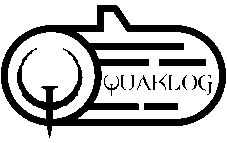

[](https://coveralls.io/github/gbzarelli/quaklog-api?branch=master)

# QuakLog API  [](https://circleci.com/gh/gbzarelli/quaklog-api)

<p align="center">
    
</p>

A `QuakLog` é um serviço para importação de arquivos de `log` do jogo `Quake`.

Uma vez que o arquivo de `log` é importado ele é transformado em dados legíveis sobre
as diversas partidas registradas pelo jogo, após a transformação ser realizada o documento
referente a cada `partida` ganha uma chave e é registrada em um banco de dados `NoSQL` para que
seja permitido posteriormente realizar consultas mais detalhadas.

# Tecnologias utilizadas

- [`Java/OpenJDK 11`](https://openjdk.java.net/projects/jdk/11/) - Java Development Kit 11
- [`Spring boot`](https://spring.io) - Framework base para a API
- [`MongoDB`](https://www.mongodb.com) - Base de dados não relacional
- [`Swagger`](https://swagger.io) - Documentação de API de forma dinâmica
- [`Caffeine`](https://github.com/ben-manes/caffeine) - Biblioteca de cache
- [`Docker`](https://www.docker.com) - Executa e gerencia aplicações dentro de invólucros chamados containers
- [`jUnit5 e Mockito`](https://junit.org/junit5/) - Execução de testes

# Endpoints

A `QuakLog` disponibiliza os seguintes `endpoints` em sua `API`

## 1 - Importação do arquivo de log

Endpoint para realizar a importação do arquivo de LOG do jogo.

- PATH: **POST /game**
- Headers:
  - Content-Type: `multipart/form-data`
  - Log-File-Date: `{logFileDate}`
      - Exemplo do parametro `logFileDate`: `2019-12-07`
- Body:
  - **from-data name="file" value: {bytes}**

- Exemplo - curl

```sh
curl -X POST "http://localhost:8080/game" -H "accept: */*" -H "Log-File-Date: 2019-01-01" -H "Content-Type: multipart/form-data" -F "file=@games.log;type=text/x-log"
```

- Resultado esperado: (Code: `201`)
  - Header de resposta:
    - Location: **/game/date/{gameDate}**
  - Body:

```text
{
    "gamesIds": [
        "5d80e7a3-1e36-4692-8645-14768cd5b0cd",
        "493b3438-6c3b-4353-8807-7d044531cd9e"
    ],
    "notifications": [
        "1 - KEY not found to parse {  0:00 }",
        "3 - KEY not found to parse { 15:00 Exit: Timelimit hit.}"
    ]
}
```

## 2 -  Consulta de jogos por data

Endpoint para realizar a consulta dos jogos de maneira simplificada do arquivo importado.

- PATH: **GET /game/date/{gameDate}**
  - Exemplo do parametro `date`: `2019-12-07`

- Exemplo - curl

```sh
curl -X GET "http://localhost:8080/game/date/2019-01-01" -H "accept: */*"
```

- Resultado esperado: (Code: `200`)

Body Sample:

```text
    {
        "games":[
           "2094f7e5-2f61-40b6-b5a2-a99c72b506c8": {
              "players": [
                {
                  "id": 2,
                  "name": "Dono da Bola",
                  "kills": 13
                },
                {
                  "id": 3,
                  "name": "Isgalamido",
                  "kills": 19
                }
              ],
              "total_kills": 105,
              "detail_path": "/game/2094f7e5-2f61-40b6-b5a2-a99c72b506c8"
        },
            // [n...]
        ]
        "quantity":10
    }
```

[(Visualize um exemplo aqui)](./documentation/sample_game_list_by_date.json)

## 3 -  Consulta de detalhes do jogo

Endpoint para consultar um jogo específico de maneira detalhada.

- PATH: **GET /game/{UUID}**

- Exemplo - curl

```sh
curl -X GET "http://localhost:8080/game/7fd1a01f-4afb-49a5-b8f5-f7f790c247e4" -H "accept: */*"
```

- Resultado esperado: (Code: `200`)
  - Body: [(Visualize um exemplo aqui)](./documentation/sample_game_details.json)

# Executando com Docker

Os seguintes passos foram documentados para serem executados em uma plataforma
 `Linux`, porém os comandos com o sistema `Windows` podem ser semelhantes, mas,
 o funcionamento não é totalmente garantido.

- Certifique-se que você tenha as seguintes ferramentas instaladas:

  - [`Java JDK 11`](https://openjdk.java.net/projects/jdk/11/)
  - [`Docker`](https://docs.docker.com/install/)
  - [`Docker Compose`](https://docs.docker.com/compose/install/)
  - [`Git`](https://git-scm.com/downloads)

- Efetue o clone do projeto pelo `Git`:

```shell
$git clone https://github.com/gbzarelli/quaklog-api.git
```

- Acesse a pasta do projeto para iniciarmos a compilação:

```shell
$cd ./quaklog-api
```

- As instruções a seguir executará atravéz do [`Gradle Build Tools`](https://gradle.org) o `clean` e o `build` do projeto. O `build` executará os testes unitários para garantir a integridade do projeto e irá gerar o executável (`.jar`) do mesmo.

```shell
$./gradlew clean build
```

- Agora será realizado o `build` do [`Dockerfile`](./Dockerfile) gerando uma imagem
no repositório local denominada de `luizalabs/quaklog-api`.

```shell
$docker build -t luizalabs/quaklog-api .
```

- Após ter gerado a imagem da API iremos executar o projeto utilizando o [`docker-compose`](./docker-compose.yml). O `compose` irá preparar todo ambiente necessário para sua aplicação executar.

```shell
$docker-compose up
```

- Pronto, sua API está pronta e em execução na porta `8080`

# Documentação dinâmica com o Swagger

A `Swagger UI` fornece uma estrutura de exibição que é capaz de interpretar os `endpoints` do projeto
e gera um site de documentação interativa

- http://localhost:8080/swagger-ui.html

# Desenvolvedor

**Guilherme Biff Zarelli**
- Blog/Site - https://helpdev.com.br
- LinkedIn - https://linkedin.com/in/gbzarelli/
- GitHub - https://github.com/gbzarelli
- Email - gbzarelli@helpdev.com.br